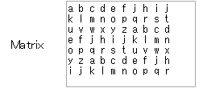

## 自動ログイン

<form name="code">
<table border="0">
  <tbody>
    <tr>
      <td>Account</td>
      <td><input type="text" name="usr_id" value=""></td>
    </tr>
    <tr>
      <td>Password</td>
      <td><input type="text" name="usr_pass" value=""></td>
    </tr>
    <tr>
      <td>Matrix</td>
      <td><textarea name="matrix" rows="8" cols="20" style="resize:none;"></textarea></td>
    </tr>
    <tr>
      <td>code</td>
      <td><input type="text" name="code1" value=""></td>
    </tr>
    <tr>
      <td colspan="2">
      <input type="radio" name="usr_int" value="pc" id="b1" checked><label for="b1">PC</label>
      <input type="radio" name="usr_int" value="sp" id="b2"><label for="b2">スマートフォン</label>
      </td>
    </tr>
    <tr>
      <td colspan="2"><input type="button" value="作成" onclick="create()"></td>
    </tr>
    <tr>
      <td colspan="2">
Output
</td>
    </tr>
    <tr>
      <td colspan="2"><textarea name="output1" rows="4" cols="20" style="resize:none;"></textarea></td>
    </tr>
  </tbody>
</table>
</form>

## 説明&使い方

### このコンテンツについて

このコンテンツは、東工大ポータルにログインする際に入力する必要があるアカウント名、パスワード、マトリクスコードを自動的に入力するブックマークレットを作成するものです。
ブックマークレットとは、ブックマーク(お気に入り)に登録しておくことで、ウェブページで便利な機能を使用することが出来るというものです。

### 当ページの使用方法

AccountとPasswordには、東工大ポータルにログインする際の自身のアカウント名とパスワードを入力してください。
ただし、ブラウザによっては、アカウント名とパスワードは自動的に入力してくれるため、アカウント名とパスワードを入力する画面では自動ログインは必要ないという人もいるでしょう。その場合はAccountとPasswordは空白にしておいてかまいません。その場合は、アカウント名とパスワードを入力する画面では自動ログインしないブックマークレットを作成します。

Matrixには、自身のマトリクスコードを入力してください。入力する際は以下の入力サンプルのように、半角で、アルファベット間を半角スペースで空け、A列からJ列まで入力したら改行してください。(改行するときは半角スペースは入力しないでください。)

共用のパソコンなどで、他人に自動ログインされると困るという人もいるでしょう。その場合はcodeの欄にパスコードを入力してください。codeの欄に入力した場合、作成したブックマークレットを使用する際に、入力したパスコードを要求されるようになるため、他の人に使用されずに済みます。
逆にcodeの欄を空白にした場合、作成したブックマークレットを使用する際にパスコードを入力する必要はありません。

2015年4月から、スマートフォンで東工大ポータルにアクセスしたときに、スマートフォン用のページが表示されるようになり、1つのブックマークレットでパソコンとスマートフォンの両方に対応することが出来なくなりました。
従いまして、パソコンで使用する方はPCを、スマートフォンで使用する方はスマートフォンを選択してください。

以上の項目を入力しましたら、作成のボタンを押してください。
下のボックスに作成されたブックマークレットが出力されるので、それをブックマークに登録してください。
ブックマークへの登録は、まず適当なページをブックマークし、そのブックマークを編集し、アドレスを作成したブックマークレットに変更することでできます。
ブックマークバーにリンクをドラッグ&ドロップすることでブックマーク出来るブラウザであれば、作成のボタンを押すと出現するAutoLoginというリンクをドラッグ&ドロップすることでブックマークに登録することが出来ます。

### ブックマークレットの使用方法

ブックマークへの登録が出来たら、ブックマークレットを使用してみましょう。東工大ポータルのログインの画面で登録したブックマークを開くと、自動ログインすることが出来ます。

